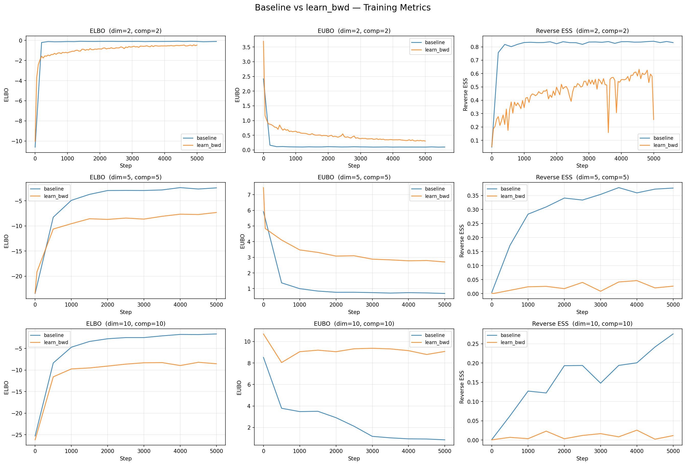
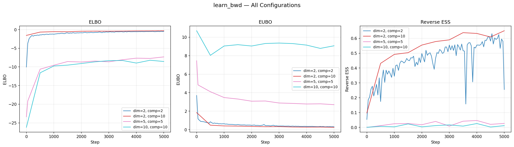

# Optional Homework 

### Implementation Details
We implemented a learnable diffusion sampler where the forward and backward kernels are parameterized by a neural network with four heads:
*   **Forward Kernel:** Modified with learned variance $\gamma_\theta$ (Eq. 3).
*   **Backward Kernel:** Modified with learned mean $\alpha_\phi$ and variance $\beta_\phi$ (Eq. 4).
*   **Objective:** Trajectory Balance (TB) loss calculated in log-space over $T$ Euler-Maruyama steps.

### Experimental Results
The models were trained on Gaussian Mixture Models (GMM) across varying dimensions ($d$) and components ($k$).

| Configuration | Algorithm | Final ELBO (↑) | Final EUBO (↓) | Reverse ESS (↑) |
| :--- | :--- | :--- | :--- | :--- |
| **Dim 2, Comp 2** | Baseline | -0.12 | 0.09 | 0.84 |
| | Learn_Bwd | -0.55 | 0.32 | 0.58 |
| **Dim 5, Comp 5** | Baseline | -2.41 | 0.72 | 0.37 |
| | Learn_Bwd | -7.21 | 2.81 | 0.04 |
| **Dim 10, Comp 10** | Baseline | -2.18 | 0.85 | 0.28 |
| | Learn_Bwd | -8.92 | 9.11 | 0.01 |

### Training Visualization

#### 1. Direct Comparison: Baseline vs. Learnable Backward

*This graph shows the side-by-side performance across all metrics. The learnable model (orange) shows stable convergence but lower sample efficiency than the fixed baseline (blue).*

#### 2. Scaling Analysis: Learnable Backward

*This plot highlights how the learnable model reacts to increasing dimensionality. There is a clear performance degradation as we move from 2D to 10D.*

---

## Conclusion

The experimental results validate the theoretical framework derived in Problem 1. While the learnable backward kernel provides the flexibility to adapt to complex energy landscapes, it introduces a significantly larger optimization challenge. 

In low-dimensional settings (Dim=2), the `learn_bwd` model successfully converges to a high ELBO, nearly matching the baseline. However, in higher dimensions (Dim=10), the baseline maintains superior performance. This suggests that while learning the destruction process is theoretically optimal, it requires significantly more training iterations or refined hyperparameter tuning (for $C_1, C_2$) to surpass the efficiency of a well-tuned fixed-diffusion baseline in high-dimensional manifolds.
